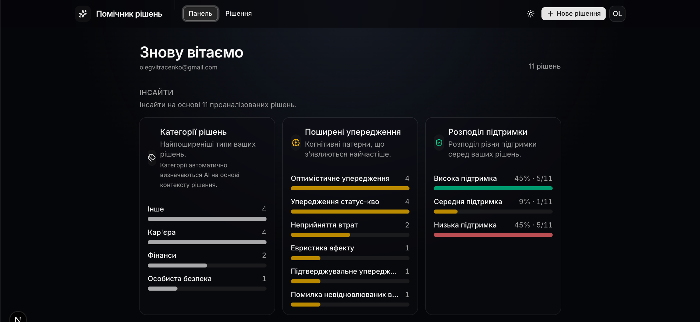
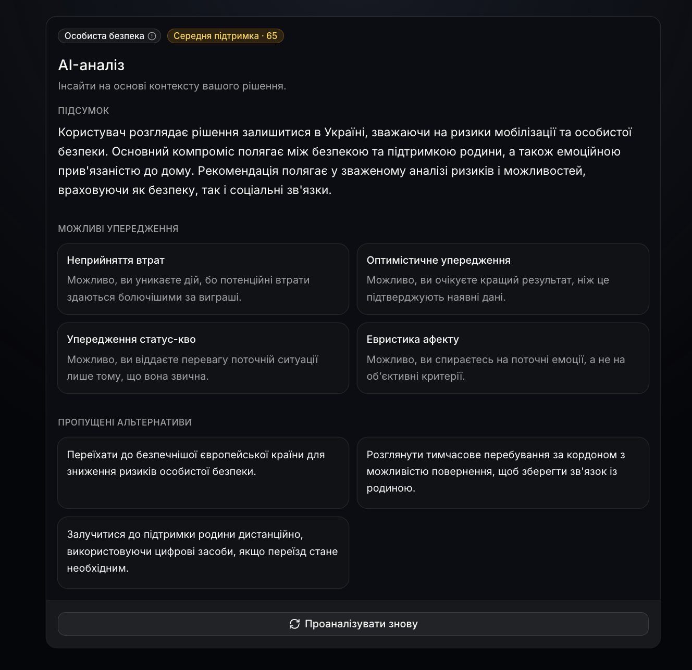

# Decision Assistant

AI-powered application for analyzing personal and professional decisions using OpenAI, Supabase, and Next.js.

## Live Demo

[Decision Assistant Demo](https://decision-assistant-gules.vercel.app)

## GitHub Repository

[Decision Assistant Repository](https://github.com/olehvitriachenko/decision-assistant)

---

## Overview

Decision Assistant helps users evaluate important personal and professional decisions by combining structured decision tracking with AI-generated insights.

Users can:

- Create and manage decisions
- Receive AI-powered analysis
- Detect cognitive biases
- Explore alternative options
- Track decision patterns through a personalized dashboard

## Screenshots

### Dashboard



Analytics dashboard showing decision categories, cognitive bias trends, support distribution, and recent decisions.

### AI Decision Analysis



Detailed AI-generated analysis including summary, detected biases, support score, and alternative options.

## Features

### Authentication

- Registration and login with Supabase Auth
- Protected routes
- Secure session management

### Decision Management

- Create decisions (situation, decision, optional thoughts)
- Browse decision history with filters and sorting
- View decision details
- Re-analyze decisions
- Delete decisions

### AI Analysis

Each decision is analyzed using OpenAI and includes:

- Decision category
- Support score (0–100)
- Cognitive bias detection
- Alternative options
- AI-generated summary

### Dashboard Insights

- Category frequency visualization
- Cognitive bias frequency visualization
- Support score distribution
- Recent decisions overview

### UX States

- Loading states (form submission, page skeletons, processing indicator)
- Error states with retry
- Automatic refresh while analysis is in progress

### Background Processing

AI analysis runs asynchronously:

1. User submits a decision
2. Decision is stored with `processing` status
3. User is redirected immediately
4. Analysis runs in the background
5. Results appear automatically when completed

### Bonus

- Dark mode
- Decision filters (status, category, bias)
- Sorting (date, confidence, complexity, title)
- Dashboard visualizations

## Tech Stack

### Frontend

- Next.js 16
- React 19
- TypeScript
- Tailwind CSS
- shadcn/ui

### Backend

- Supabase
- PostgreSQL
- Row Level Security (RLS)

### AI

- OpenAI GPT-4.1 Mini
- Structured Outputs
- Zod validation

## Project Structure

```
src/
├── app/
├── components/
├── lib/
│   ├── actions/
│   ├── db/
│   ├── openai/
│   └── supabase/
└── types/

supabase/
└── migrations/
```

## Architecture Decisions

### Background AI Processing

The application follows a "save first, analyze later" approach to avoid blocking users while waiting for LLM responses. Analysis is executed asynchronously using Next.js `after()` post-response processing.

### Security

- Row Level Security enabled
- User-level data isolation
- Service role key used only for server-side admin operations
- Database-level validation constraints

### Validation

Validation is implemented on multiple levels:

- Client-side validation
- Zod schemas
- PostgreSQL constraints

## Environment Variables

Copy `.env.example` to `.env` (or `.env.local` for Next.js):

```env
NEXT_PUBLIC_SUPABASE_URL=
NEXT_PUBLIC_SUPABASE_PUBLISHABLE_KEY=
SUPABASE_SECRET_KEY=
OPENAI_API_KEY=
```

| Variable | Description |
|----------|-------------|
| `NEXT_PUBLIC_SUPABASE_URL` | Supabase project URL |
| `NEXT_PUBLIC_SUPABASE_PUBLISHABLE_KEY` | Supabase publishable (anon) key |
| `SUPABASE_SECRET_KEY` | Supabase secret (service role) key — server only |
| `OPENAI_API_KEY` | OpenAI API key — server only |

## Local Development

**Prerequisites:** Node.js 20+, Supabase project, OpenAI API key

```bash
git clone https://github.com/olehvitriachenko/decision-assistant.git
cd decision-assistant
npm install
cp .env.example .env   # fill in values
npm run db:link        # once, links local Supabase CLI to remote project
npm run db:push        # apply migrations
npm run dev
```

Open [http://localhost:3000](http://localhost:3000).

## Deployment

1. Push the repo to GitHub
2. Import the project on [Vercel](https://vercel.com)
3. Add all environment variables from `.env.example`
4. In Supabase → **Authentication → URL Configuration**, add the Vercel production URL to allowed redirect URLs

## Database

Migrations live in `supabase/migrations/`:

- `decisions` — user decisions with status (`processing`, `completed`, `failed`)
- `analyses` — structured AI output linked to decisions
- RLS policies ensure users access only their own data

## Future Improvements

- Multi-language support
- Decision comparison
- Export functionality
- Advanced analytics

## Notes

This project was built as part of a Product Engineer (Fullstack) technical assessment focused on architecture design, AI integration, security, UX, and product thinking.
